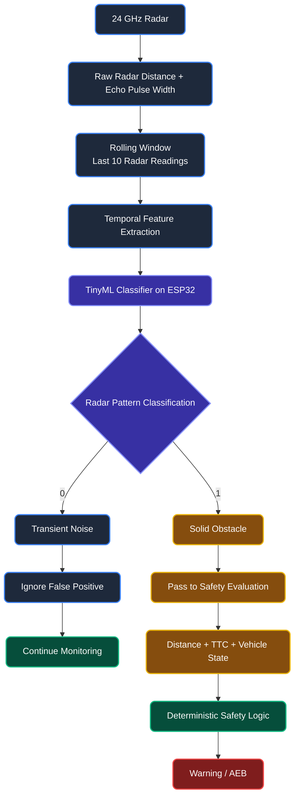
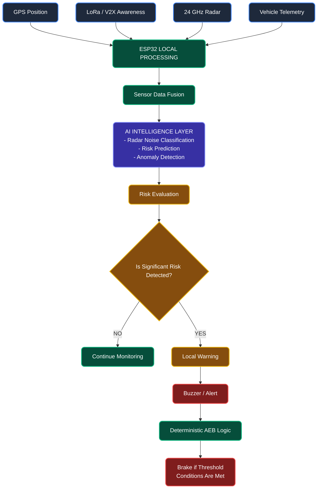
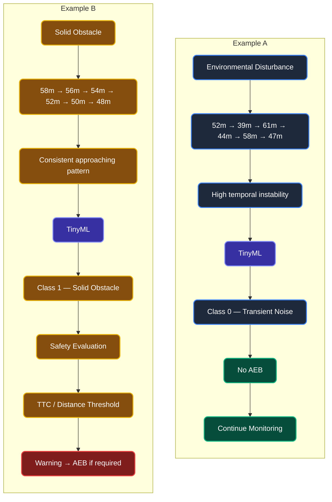
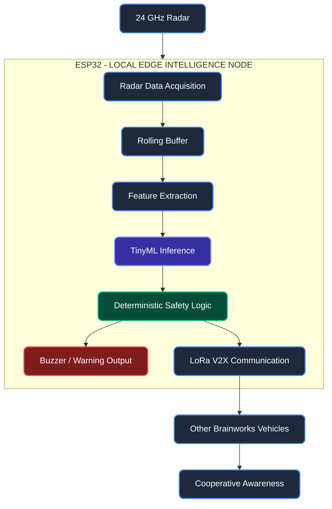
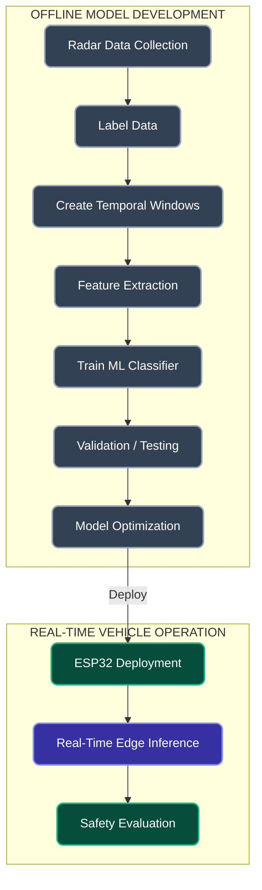

# Brainworks AI/ML Integration

# AI Workflow & Decision Architecture

Brainworks follows a layered safety architecture in which Edge AI improves sensor interpretation while deterministic safety logic remains responsible for the final safety response.

*(Note: The AI/TinyML implementation described below is a Proposed / Planned Implementation for future prototype iterations).*

### 1. Edge AI Radar Classification

This workflow demonstrates how raw radar data is processed locally on the ESP32 to filter out transient noise before it reaches the safety evaluation logic. The AI classifier runs LOCALLY on the ESP32 and does not require cloud processing.

### 2. Complete AI-Assisted Safety Workflow

This system-level workflow shows how AI assists the safety system without acting as the sole authority for emergency braking. Deterministic safety rules provide the final safety response.

*Note: AI assists the safety system but does not act as the sole authority for emergency braking. Deterministic safety rules provide the final safety response.*

### 3. Radar Noise vs Solid Obstacle Example

This example demonstrates why TinyML is useful for filtering environmental disturbances versus solid approaching objects.

### 4. Hardware + AI Data Flow

This workflow illustrates how the radar data moves through the ESP32 and eventually reaches other vehicles via cooperative awareness.

### 5. AI Training → Deployment → Inference

This diagram clearly distinguishes the offline model development phase from real-time vehicle operation.

### Architecture Summary

| Layer | Technology | Purpose | Location |
|------|------------|---------|----------|
| Sensing | 24 GHz Radar | Local obstacle detection | Vehicle |
| Edge AI | TinyML Classifier | Radar noise classification | ESP32 |
| Communication | LoRa / V2X | Nearby vehicle awareness | Vehicle-to-Vehicle |
| Risk Evaluation | Rule-based logic | Determine safety state | ESP32 |
| Safety Response | Deterministic AEB | Emergency response | ESP32 |
| Operator Interface | Buzzer / Simulation UI | Warning and visualization | Vehicle / Software |

### Why This Architecture Matters

1. **AI reduces false positives:** By classifying transient noise vs. solid obstacles, unnecessary braking events are minimized.
2. **Edge inference avoids cloud dependency:** Processing data locally on the ESP32 ensures zero latency and works without cellular networks.
3. **V2X provides awareness beyond the local radar field:** LoRa communication enables nodes to share awareness before hazards are visible to radar.
4. **Deterministic logic provides predictable emergency response:** Rule-based logic acts as the final safety authority, ensuring the system always responds safely regardless of AI edge cases.
5. **Fallback safety path:** The architecture continues to provide a baseline deterministic safety path if AI inference becomes temporarily unavailable.