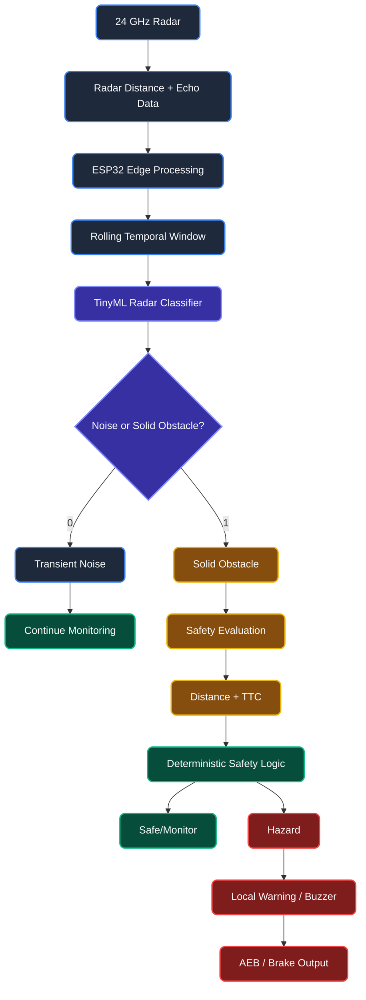

# Brainworks — Edge AI Integration

Brainworks uses Edge AI on the ESP32 to improve the reliability of 24 GHz radar-based obstacle detection. A lightweight TinyML classifier analyzes a short temporal window of radar readings to distinguish persistent physical obstacles from transient environmental noise. The classification is performed locally on the vehicle, enabling low-latency operation without cloud dependency.

**Status: Proposed / Planned Implementation**



## How It Works

- **Input:** 24 GHz radar provides distance and echo measurements.
- **Temporal Analysis:** The ESP32 maintains a rolling window of the latest radar readings.
- **Edge AI:** A lightweight TinyML classifier identifies whether the radar signature resembles transient noise or a solid obstacle.
- **Safety Evaluation:** Solid-obstacle detections are passed to distance/TTC-based deterministic safety logic.
- **Response:** The system can activate the local buzzer/warning and, when safety thresholds are reached, trigger the AEB/braking output.

## AI Classification

```text
0 → Transient Noise / False Positive
1 → Solid Obstacle
```
