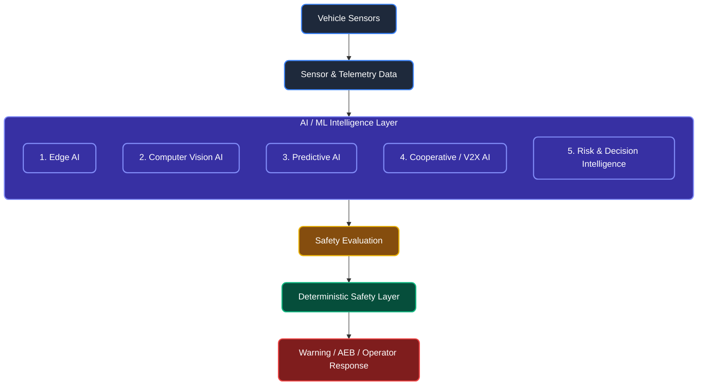
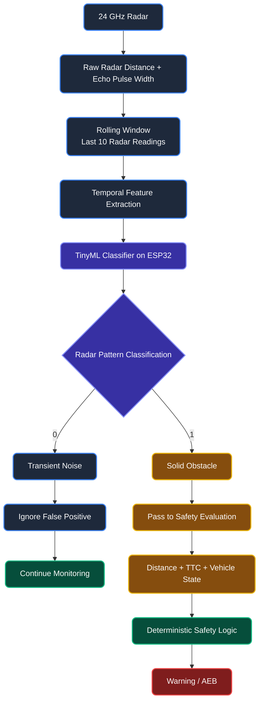
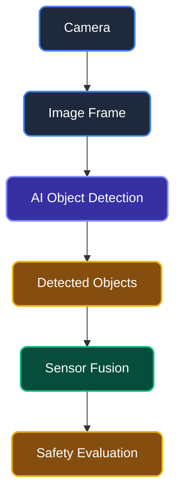

# Brainworks AI/ML Integration

## AI/ML Architecture

Brainworks utilizes a multi-layered safety architecture where complementary AI systems enhance perception, prediction, cooperative awareness, and risk intelligence. While deterministic safety logic ultimately governs emergency responses (such as AEB), the AI/ML intelligence layer acts as a highly capable perceptual aid and predictive engine, drastically reducing false positives and improving early hazard detection.



## 1. Edge AI

### 1.A Radar Noise Classification — TinyML

**Status: Proposed / Planned Implementation for future prototype iterations**

Raw radar data in harsh mining environments can be noisy, generating false readings from dust, rain, or transient environmental disturbances. To solve this, a TinyML classifier runs LOCALLY on the ESP32 to filter out transient noise before it reaches the safety evaluation logic. This approach does not require cloud processing and ensures zero latency.

#### Workflow Diagram



#### Detailed Explanation
- **Problem**: Harsh mining conditions lead to radar false positives.
- **Model**: A lightweight decision tree or neural network optimized for Edge processing (TinyML).
- **Input Data**: Raw radar distance and echo pulse width over time.
- **Rolling Window**: Analyzes the last 10 radar readings as a time-series sequence.
- **Feature Extraction**: Extracts velocity consistency, signal strength, and temporal stability.
- **Classification**: Outputs binary states: `0` (Transient Noise) or `1` (Solid Obstacle).
- **Edge Inference**: The model runs entirely on the ESP32 microcontroller.
- **Safety Decision**: Only solid obstacle classifications are passed to the deterministic logic for TTC (Time-To-Collision) calculation and potential AEB triggering.
- **Failure-Safe Design**: If the model fails to return a result within a timeout, the system defaults to treating raw radar readings as solid obstacles.
- **Hardware Architecture**: The AI inference is fully embedded on the local processing node without cellular or cloud dependency.

## 2. Computer Vision AI

### 2.A Object / Obstacle Detection

**Status: Proposed / Planned Implementation**

This module intends to use camera-based perception to visually detect objects in the vehicle's path. Using lightweight object detection models, the system will identify specific hazard categories such as:
- Mining trucks
- Personnel
- Excavators
- Rocks / debris
- Other obstacles

#### Proposed Workflow



### 2.B Vision-Based Environmental Perception

**Status: Proposed / Planned Implementation**

Future iterations will incorporate scene understanding algorithms optimized for challenging mining environments. Planned capabilities include:
- Dust-aware perception
- Low-light perception
- Scene understanding

## 3. Predictive AI

### 3.A Risk Prediction

**Status: Proposed / Planned Implementation**

A predictive AI model that estimates the vehicle's future safety risk by evaluating a multimodal set of dynamic operational variables.

**Inputs:**
- Vehicle speed
- GPS position
- Heading
- Radar observations
- TTC
- Nearby vehicle information
- LoRa/V2X status
- Road/environment conditions

**Outputs:**
```text
Risk Score: 0–100
Risk Level:
LOW
MEDIUM
HIGH
CRITICAL
```
This risk score acts as an early advisory indicator for the vehicle operator, allowing for proactive speed reduction before deterministic emergency systems (AEB) need to intervene.

## 4. Cooperative / V2X AI

### 4.A Network-Aware Threat Evaluation

**Status: Proposed / Planned Implementation**

Leverages AI to analyze the behavior of surrounding Brainworks nodes via LoRa communications. By observing the broadcasted speed, position, and heading of multiple nearby vehicles, the V2X AI can predict potential trajectory conflicts at intersections or blind corners earlier than line-of-sight radar can.

## 5. Risk & Decision Intelligence

### 5.A Contextual Anomaly Detection

**Status: Proposed / Planned Implementation**

Monitors the vehicle's telemetry stream over time to identify operational anomalies (e.g., unusual braking patterns, erratic steering, or unexpected acceleration) that could indicate mechanical issues or hazardous road conditions (such as slippery haul roads). Anomalies are logged and reported to the centralized fleet management system for preventative maintenance and site-wide safety awareness.