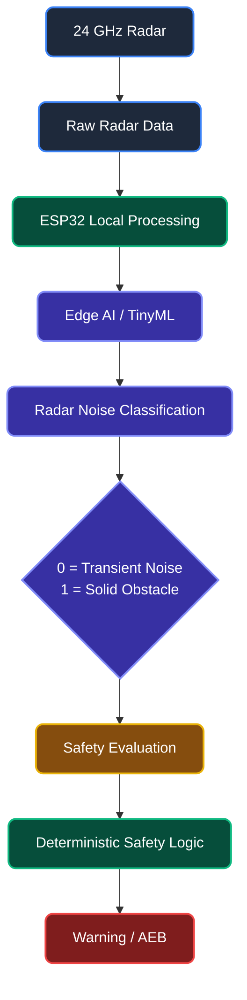
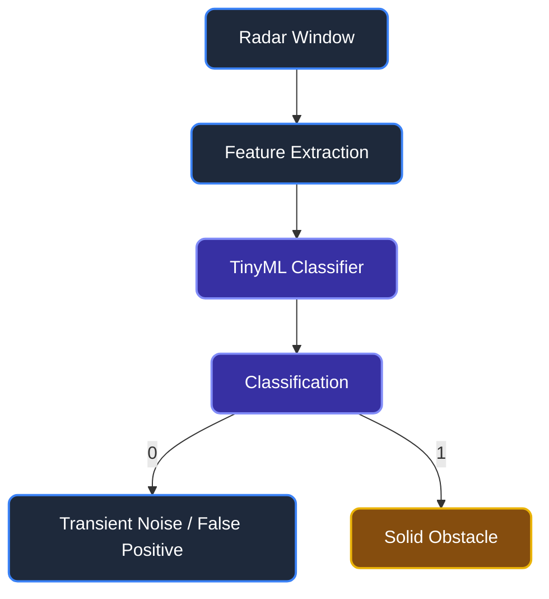
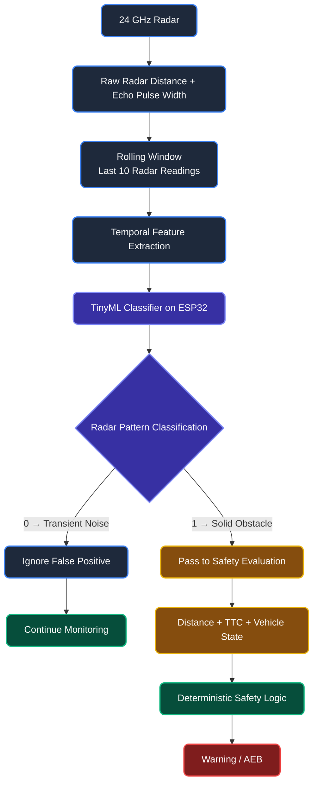
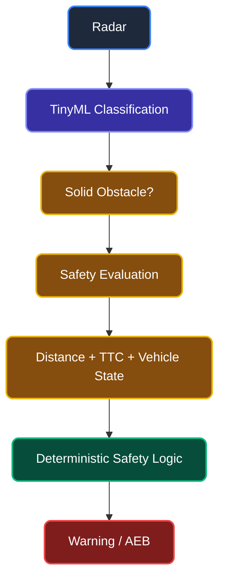
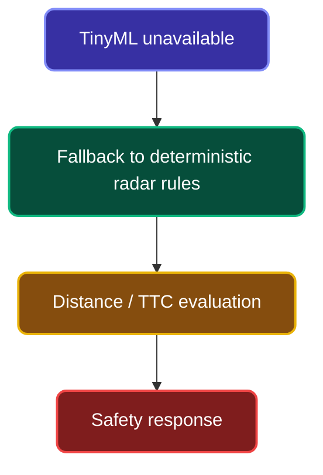
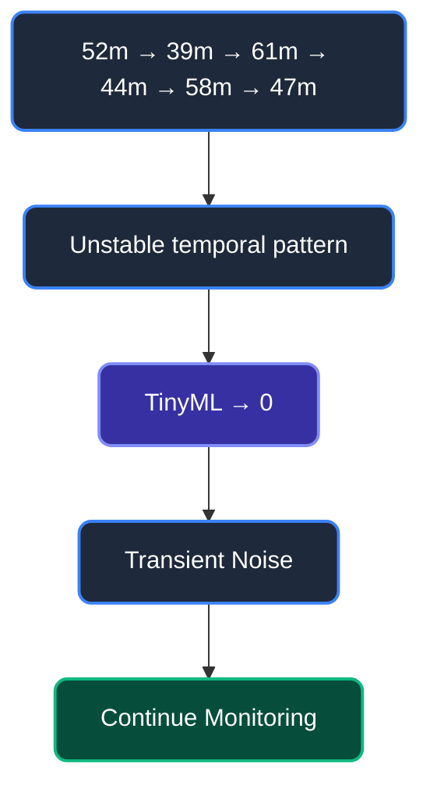
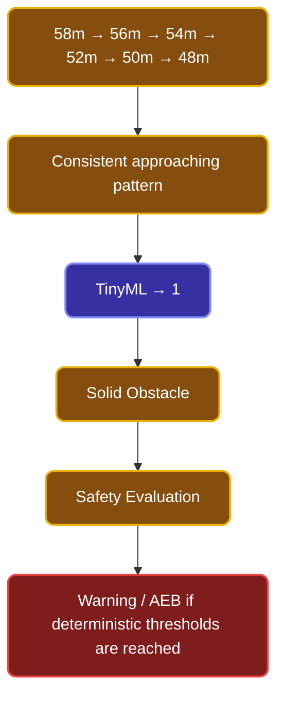
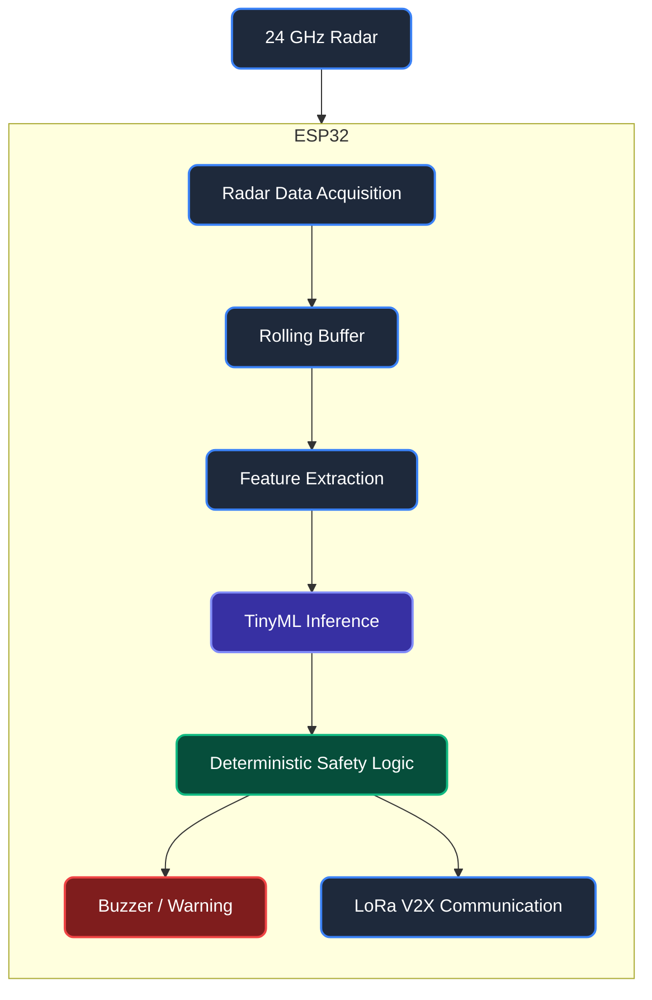

# Brainworks AI/ML Integration

## AI/ML Architecture

### Edge AI Architecture

Brainworks currently focuses on an Edge AI subsystem for radar signal classification. Additional AI capabilities may be integrated in future iterations.

## 1. Edge AI — Radar Noise Classification

### 1.1 Problem

Explain the radar false-positive problem caused by:
- Dense falling debris
- Heavy rain
- Dust/environmental interference
- Vehicle vibrations
- Temporary radar reflections

### 1.2 Model

**Status: Proposed / Planned Implementation**

The proposed lightweight classifier:
- Random Forest Classifier OR SVM
- Intended for low-latency Edge AI inference
- Runs locally on ESP32
- No cloud dependency

### 1.3 Input Data

- Last 10 radar distance readings
- Last 10 echo pulse-width readings

The rolling temporal window ensures the system observes trends rather than instantaneous noise points.

### 1.4 Temporal Feature Extraction

- Mean distance
- Minimum distance
- Maximum distance
- Distance variance
- Distance range
- Mean pulse width
- Pulse-width variance
- Distance trend
- Rate of distance change
- Sudden measurement jumps

### 1.5 TinyML Classification

### 1.6 Detailed Edge AI Workflow

### 1.7 Safety Integration

Edge AI improves radar interpretation by reducing transient false positives. The final safety response remains governed by deterministic safety rules. AI does NOT directly control emergency braking.

### 1.8 Failure-Safe Design

If the TinyML inference is unavailable, the system should fall back to a deterministic radar safety fallback.

### 1.9 Training Pipeline

```mermaid
flowchart TD
    classDef normal fill:#1e293b,stroke:#3b82f6,stroke-width:2px,color:#fff,rx:8px,ry:8px;
    classDef warning fill:#854d0e,stroke:#eab308,stroke-width:2px,color:#fff,rx:8px,ry:8px;
    classDef danger fill:#7f1d1d,stroke:#ef4444,stroke-width:2px,color:#fff,rx:8px,ry:8px;
    classDef ai fill:#3730a3,stroke:#818cf8,stroke-width:2px,color:#fff,rx:8px,ry:8px;
    classDef logic fill:#064e3b,stroke:#10b981,stroke-width:2px,color:#fff,rx:8px,ry:8px;
    classDef offline fill:#334155,stroke:#94a3b8,stroke-width:2px,color:#fff,rx:8px,ry:8px;

    subgraph OFFLINE [OFFLINE MODEL DEVELOPMENT]
        direction TB
        D1[Radar Data Collection]:::offline
        D2[Label Radar Windows]:::offline
        D3[Feature Extraction]:::offline
        D4[Train Classifier]:::offline
        D5[Validation / Testing]:::offline
        D6[Model Optimization]:::offline
        
        D1 --> D2 --> D3 --> D4 --> D5 --> D6
    end
    
    D6 -->|Deploy| R1
    
    subgraph ONLINE [REAL-TIME ESP32 INFERENCE]
        direction TB
        R1[ESP32 Deployment]:::logic
        R2[Real-Time Edge Inference]:::ai
        
        R1 --> R2
    end
```

### 1.10 Example Scenarios

#### Scenario A — Transient Noise

#### Scenario B — Solid Obstacle

### 1.11 Performance Metrics

Evaluation metrics:
- Accuracy
- Precision
- Recall
- F1 Score
- False Positive Rate
- False Negative Rate
- Inference Latency
- RAM Usage
- Flash Usage

### 1.12 Hardware Data Flow

