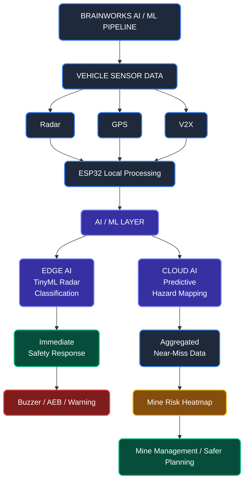
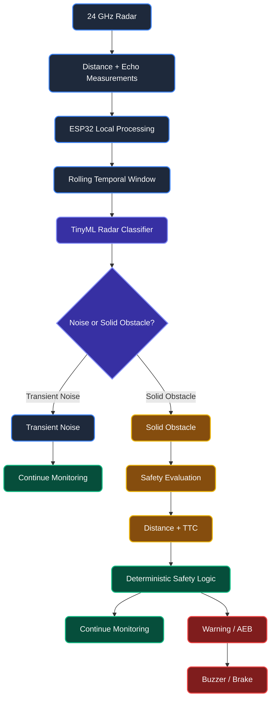
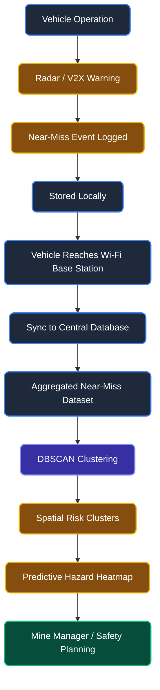

# Brainworks — AI/ML Integration

Brainworks combines two complementary AI/ML integrations: Edge AI for real-time radar interpretation on the vehicle, and Cloud AI for analyzing accumulated near-miss events to identify high-risk zones across the mine.

**Current AI/ML Integrations**
- Edge AI — TinyML Radar Noise Classification
- Cloud AI — Predictive Hazard Mapping

## Main AI/ML Architecture

# 1. Edge AI — Radar Noise Classification (TinyML)

Raw 24 GHz radar can produce transient false positives caused by falling debris, heavy rain, dust, or vehicle vibration. A lightweight TinyML classifier running directly on the ESP32 analyzes a short temporal window of radar measurements to distinguish transient noise from a persistent physical obstacle.

**Status: Proposed / Planned Implementation**

### Workflow

### Key Points

- **Input:** Last 10 radar distance readings + echo pulse widths.
- **Model:** Lightweight TinyML classifier such as Random Forest or SVM.
- **Output:** `0 = Transient Noise`, `1 = Solid Obstacle`.
- **Execution:** Local inference on ESP32 with no cloud dependency.
- **Safety:** AI assists perception; deterministic rules handle the final safety response.

# 2. Cloud AI — Predictive Hazard Mapping

While vehicles operate in the mine, Brainworks records near-miss events whenever safety warnings such as V2X or radar alerts are triggered. When vehicles return to a Wi-Fi-enabled base station, these events can be synchronized with a central database for mine-wide analysis.

**Problem:**  
Mine managers need to identify where near-misses repeatedly occur so that high-risk sections of haul roads can be improved before they become accident locations.

**Model:** DBSCAN (Density-Based Spatial Clustering of Applications with Noise)

**Input:** Aggregated near-miss event data containing:
- Latitude
- Longitude
- Speed
- Timestamp

**Output:** Predictive spatial heatmap showing clusters of high-risk zones along haul roads.

**Status: Proposed / Planned Implementation**

### Workflow

### Key Points

- **Data:** Near-miss events generated by radar/V2X safety alerts.
- **Fields:** Latitude, Longitude, Speed, Timestamp.
- **ML Model:** DBSCAN for spatial density clustering.
- **Output:** High-risk spatial clusters and predictive hazard heatmap.
- **Purpose:** Help mine managers identify recurring danger zones and prioritize infrastructure/safety improvements.
- **Connectivity:** Vehicles can collect events offline and synchronize them when Wi-Fi connectivity becomes available at the base station.

## AI/ML Integration Summary

| Integration | Where AI Runs | Input | Output | Purpose |
|---|---|---|---|---|
| Edge AI — TinyML | ESP32 / Vehicle | Radar temporal data | Noise / Solid Obstacle | Immediate local safety |
| Cloud AI — DBSCAN | Central system | Near-miss GPS/event data | Risk clusters / Heatmap | Mine-wide predictive safety |

> **Edge AI protects the vehicle in the moment. Cloud AI learns from accumulated events to make the mine safer over time.**

> **AI improves perception and prediction; deterministic safety logic remains responsible for the final immediate safety response.**
