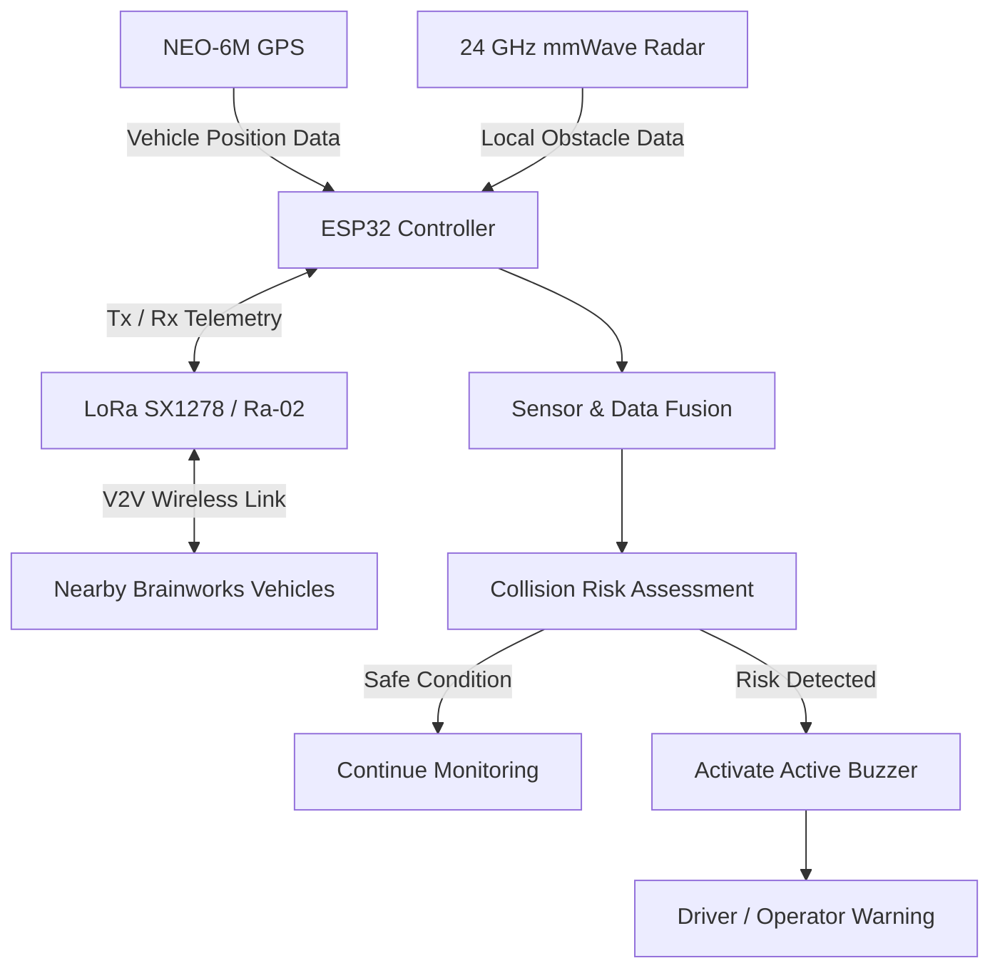

# Brainworks – Hardware Architecture

## Overview

Brainworks is an infrastructure-independent collision warning and situational awareness system designed for mining environments with poor visibility, hazardous operating conditions, and unreliable communication infrastructure.

The prototype uses:

- ESP32 as the main controller
- LoRa SX1278 / Ra-02 for long-range vehicle-to-vehicle communication
- NEO-6M GPS for vehicle positioning
- 24 GHz mmWave radar for obstacle detection
- Active buzzer for immediate collision alerts

### 1. Cooperative Awareness

Vehicles equipped with Brainworks share their position and identity through GPS and LoRa communication.

### 2. Non-Cooperative Detection

The mmWave radar detects nearby obstacles that cannot transmit location information.

## Hardware Components

The Brainworks prototype combines communication, positioning, sensing, processing, and local alerting hardware to form an integrated hardware architecture.

| Component | Role in Brainworks | Interface / Function |
|---|---|---|
| ESP32 | Main processing and control unit | Collects sensor data, processes received information, evaluates risk, and controls alerts |
| LoRa SX1278 / Ra-02 | Long-range wireless communication | Enables direct exchange of vehicle information between Brainworks nodes |
| NEO-6M GPS | Vehicle positioning | Provides geographic position data for vehicle awareness |
| 24 GHz mmWave Radar | Local obstacle detection | Detects nearby obstacles or objects that may not participate in communication |
| Active Buzzer | Local warning mechanism | Produces an immediate audible alert when a risk condition is detected |
| Regulated Power Supply | Power management | Provides appropriate regulated power to the prototype components |

### ESP32 – Processing and Control

The ESP32 acts as the central controller for the system. It coordinates GPS data acquisition, manages LoRa communication, processes radar inputs, evaluates collision risk based on incoming data streams, and triggers local alert mechanisms when necessary.

### LoRa SX1278 / Ra-02 – Vehicle-to-Vehicle Communication

The LoRa SX1278 / Ra-02 module enables direct long-range wireless communication between Brainworks nodes. This peer-to-peer link allows vehicles to exchange situational data independently, ensuring reliable operation without relying on cellular networks or external internet infrastructure.

### NEO-6M GPS – Position Awareness

The NEO-6M GPS module provides geographic position coordinates for the vehicle. This location data is processed locally and broadcasted to surrounding participating nodes via LoRa to support inter-vehicle cooperative awareness.

### 24 GHz mmWave Radar – Local Obstacle Awareness

The 24 GHz mmWave radar provides a local non-cooperative sensing layer. It detects nearby obstacles, unequipped vehicles, or stationary hazards that do not actively transmit location information, ensuring comprehensive situational awareness.

### Active Buzzer – Immediate Warning

The active buzzer serves as the primary local alerting mechanism. It provides immediate, high-priority audible feedback to the vehicle operator whenever the processing unit identifies a configured risk condition.

### Power System

The power system ensures stable electrical operation across all hardware components. The prototype requires appropriate voltage regulation and a common ground reference between interconnected modules to maintain signal integrity and reliable operation.

## System Architecture

Brainworks utilizes a distributed hardware architecture where each vehicle node functions as an autonomous unit capable of local sensing, long-range vehicle-to-vehicle (V2V) communication, real-time data processing, and local hazard warning generation.

### Architecture Explanation

1. **Position Acquisition**: The NEO-6M GPS module continuously acquires geographic coordinates and movement data for the vehicle.
2. **Vehicle-to-Vehicle Communication**: The ESP32 formats and transmits local position data via the LoRa SX1278 / Ra-02 module while simultaneously receiving position broadcasts from nearby Brainworks-equipped vehicles.
3. **Local Obstacle Awareness**: The 24 GHz mmWave radar actively scans the vehicle's immediate surroundings to detect non-cooperative obstacles or unequipped objects that do not transmit location data.
4. **Data Aggregation**: The central ESP32 controller collects all three data streams: local GPS position, incoming LoRa V2V telemetry, and mmWave radar detection signals.
5. **Sensor Fusion & Risk Assessment**: The aggregated data is processed through a Sensor & Data Fusion stage, where it is evaluated by a Collision Risk Assessment algorithm to determine potential collision threats.
6. **Alert Generation**: If a hazardous condition or imminent collision risk is identified, the system activates the active buzzer to provide an immediate audible warning to the driver/operator; otherwise, it continues routine monitoring.

## Communication Flow

## Sensor Fusion Strategy

## Pin Connections

## Power Architecture

## Collision Detection Logic

## Hardware Prototype

## Bill of Materials

## Future Hardware Improvements
