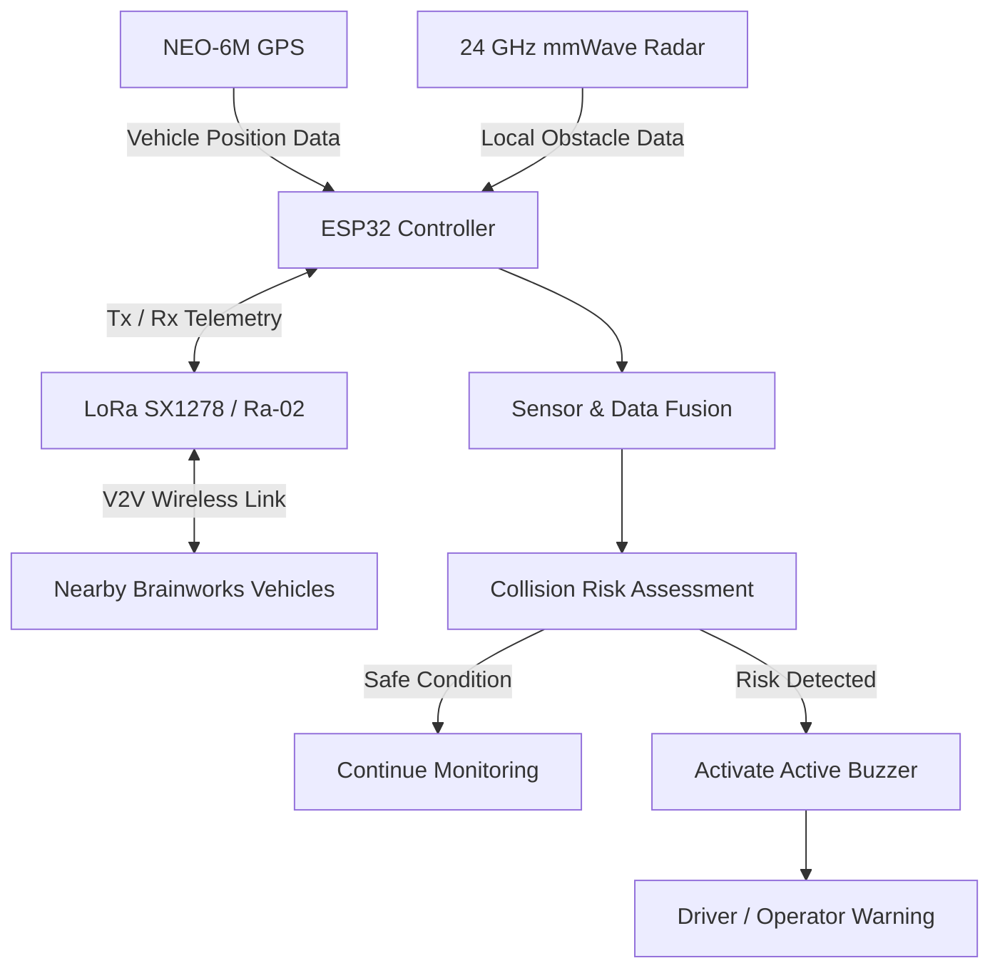
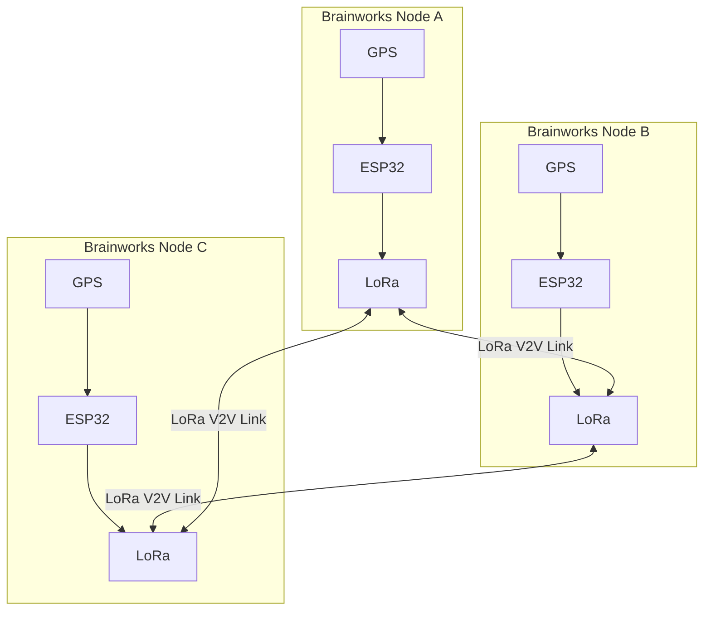
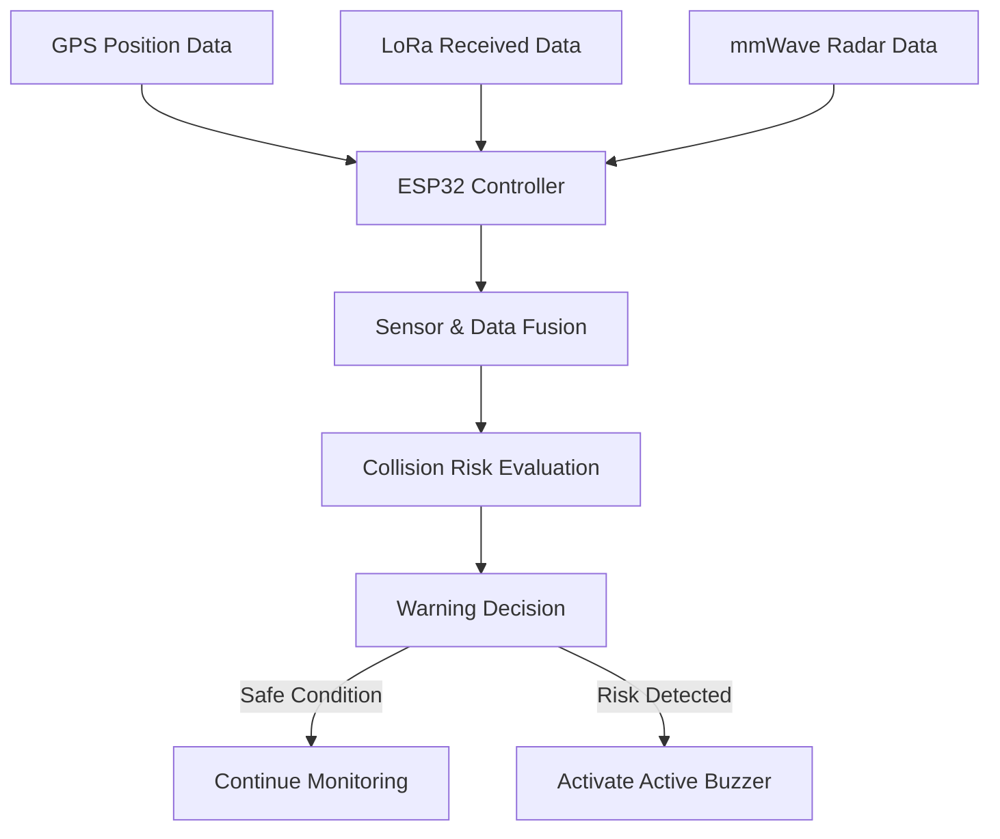
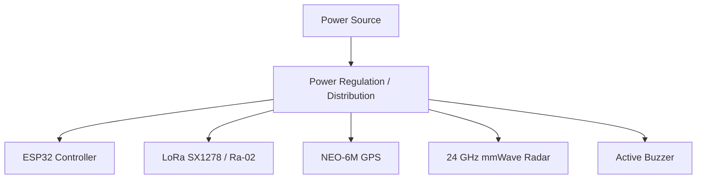
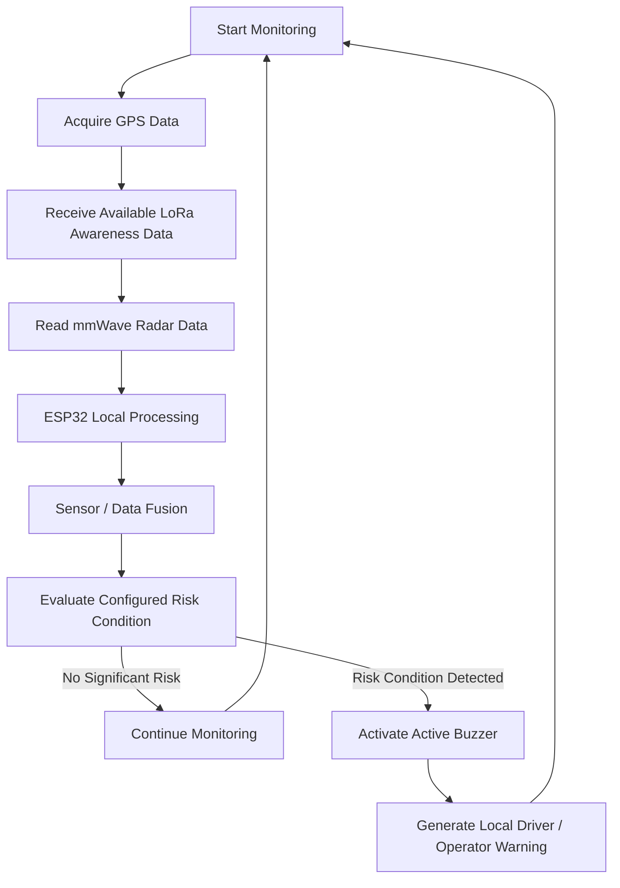

# Brainworks – Hardware Architecture

## Overview

Brainworks is an infrastructure-independent collision warning and situational awareness system designed for mining environments with poor visibility, hazardous operating conditions, and unreliable communication infrastructure.

The prototype uses:

- ESP32 as the main controller
- LoRa SX1278 / Ra-02 for long-range vehicle-to-vehicle communication
- NEO-6M GPS for vehicle positioning
- 24 GHz mmWave radar for obstacle detection
- Active buzzer for immediate collision alerts

### 1. Cooperative Awareness

Vehicles equipped with Brainworks share their position and identity through GPS and LoRa communication.

### 2. Non-Cooperative Detection

The mmWave radar detects nearby obstacles that cannot transmit location information.

## Hardware Components

The Brainworks prototype combines communication, positioning, sensing, processing, and local alerting hardware to form an integrated hardware architecture.

| Component | Role in Brainworks | Interface / Function |
|---|---|---|
| ESP32 | Main processing and control unit | Collects sensor data, processes received information, evaluates risk, and controls alerts |
| LoRa SX1278 / Ra-02 | Long-range wireless communication | Enables direct exchange of vehicle information between Brainworks nodes |
| NEO-6M GPS | Vehicle positioning | Provides geographic position data for vehicle awareness |
| 24 GHz mmWave Radar | Local obstacle detection | Detects nearby obstacles or objects that may not participate in communication |
| Active Buzzer | Local warning mechanism | Produces an immediate audible alert when a risk condition is detected |
| Regulated Power Supply | Power management | Provides appropriate regulated power to the prototype components |

### ESP32 – Processing and Control

The ESP32 acts as the central controller for the system. It coordinates GPS data acquisition, manages LoRa communication, processes radar inputs, evaluates collision risk based on incoming data streams, and triggers local alert mechanisms when necessary.

### LoRa SX1278 / Ra-02 – Vehicle-to-Vehicle Communication

The LoRa SX1278 / Ra-02 module enables direct long-range wireless communication between Brainworks nodes. This peer-to-peer link allows vehicles to exchange situational data independently, ensuring reliable operation without relying on cellular networks or external internet infrastructure.

### NEO-6M GPS – Position Awareness

The NEO-6M GPS module provides geographic position coordinates for the vehicle. This location data is processed locally and broadcasted to surrounding participating nodes via LoRa to support inter-vehicle cooperative awareness.

### 24 GHz mmWave Radar – Local Obstacle Awareness

The 24 GHz mmWave radar provides a local non-cooperative sensing layer. It detects nearby obstacles, unequipped vehicles, or stationary hazards that do not actively transmit location information, ensuring comprehensive situational awareness.

### Active Buzzer – Immediate Warning

The active buzzer serves as the primary local alerting mechanism. It provides immediate, high-priority audible feedback to the vehicle operator whenever the processing unit identifies a configured risk condition.

### Power System

The power system ensures stable electrical operation across all hardware components. The prototype requires appropriate voltage regulation and a common ground reference between interconnected modules to maintain signal integrity and reliable operation.

## System Architecture

Brainworks utilizes a distributed hardware architecture where each vehicle node functions as an autonomous unit capable of local sensing, long-range vehicle-to-vehicle (V2V) communication, real-time data processing, and local hazard warning generation.



### Architecture Explanation

1. **Position Acquisition**: The NEO-6M GPS module continuously acquires geographic coordinates and movement data for the vehicle.
2. **Vehicle-to-Vehicle Communication**: The ESP32 formats and transmits local position data via the LoRa SX1278 / Ra-02 module while simultaneously receiving position broadcasts from nearby Brainworks-equipped vehicles.
3. **Local Obstacle Awareness**: The 24 GHz mmWave radar actively scans the vehicle's immediate surroundings to detect non-cooperative obstacles or unequipped objects that do not transmit location data.
4. **Data Aggregation**: The central ESP32 controller collects all three data streams: local GPS position, incoming LoRa V2V telemetry, and mmWave radar detection signals.
5. **Sensor Fusion & Risk Assessment**: The aggregated data is processed through a Sensor & Data Fusion stage, where it is evaluated by a Collision Risk Assessment algorithm to determine potential collision threats.
6. **Alert Generation**: If a hazardous condition or imminent collision risk is identified, the system activates the active buzzer to provide an immediate audible warning to the driver/operator; otherwise, it continues routine monitoring.

## Communication Flow

Brainworks utilizes direct LoRa-based communication between participating nodes so that nearby vehicles can exchange essential awareness information without depending on cloud services or continuous internet connectivity.

### Information Flow

1. The NEO-6M GPS obtains the current geographic position of the vehicle.
2. The ESP32 reads and processes the available position information.
3. The ESP32 prepares a structured awareness message.
4. The message is transmitted through the LoRa SX1278 / Ra-02 module.
5. Nearby Brainworks nodes receive the transmitted information.
6. The receiving ESP32 processes the received data.
7. The received information is used together with local sensing data for further risk evaluation.

### Awareness Message Structure

| Field | Purpose |
|---|---|
| Vehicle / Node ID | Identifies the transmitting Brainworks node |
| Latitude | Geographic position information |
| Longitude | Geographic position information |
| Timestamp | Indicates when the information was generated |

> [!NOTE]
> This structure represents the baseline prototype-level awareness message format and can be extended with additional parameters as the system evolves.

### Vehicle-to-Vehicle Communication Diagram



### Communication Design Principles

- **Direct Node-to-Node Exchange**: Vehicles exchange awareness information directly with nearby peer nodes using wireless LoRa communication.
- **Local Processing**: Each node independently processes both locally generated sensor data and received V2V telemetry messages.
- **Infrastructure-Independent**: No reliance on cellular networks, cloud services, or external central servers for the immediate warning path.
- **Distributed Architecture**: Supports decentralized operation across arbitrary clusters of equipped vehicles.
- **Extensible Payload**: Modular awareness message structure designed for easy expansion with future telemetry parameters.

## Sensor Fusion Strategy

Brainworks employs a dual-layer perception approach to achieve situational awareness in hazardous mining environments. The system combines cooperative awareness information received from nearby participating Brainworks nodes with non-cooperative obstacle detection gathered from local radar sensing.

### 1. Cooperative Awareness Layer

Participating vehicles acquire geographic position information using an onboard NEO-6M GPS module and share structured awareness messages across the local network via LoRa communication.

The receiving Brainworks node uses these incoming messages to construct and maintain dynamic awareness of other equipped vehicles within its communication range.

```
GPS Position
     ↓
ESP32 Processing
     ↓
LoRa Transmission
     ↓
Nearby Brainworks Node
     ↓
Local Awareness Data
```

### 2. Non-Cooperative Detection Layer

Not every hazard or object in a mining operating environment is capable of transmitting its position data.

The 24 GHz mmWave radar provides an autonomous local sensing layer that detects nearby physical obstacles or objects within its configured operating capability. Potential obstacle categories include:

- Stationary obstacles
- Equipment
- Personnel or workers
- Other objects not equipped with a Brainworks communication node

```
Nearby Object
     ↓
24 GHz mmWave Radar
     ↓
ESP32
     ↓
Local Obstacle Information
```

### 3. Data Fusion and Risk Evaluation

The ESP32 acts as the local decision point for the vehicle node. It aggregates data inputs from all available perception channels:

- Local GPS position data
- LoRa awareness messages received from nearby participating Brainworks nodes
- Local non-cooperative obstacle data from the 24 GHz mmWave radar

The aggregated information streams are processed together in the sensor fusion stage and evaluated against risk logic to decide whether a warning state should be triggered.

```
GPS + LoRa Awareness
        +
mmWave Obstacle Data
        ↓
ESP32 Local Processing
        ↓
Sensor / Data Fusion
        ↓
Collision Risk Evaluation
        ↓
Warning Decision
```

### 4. Fusion Logic

| Information Source | Awareness Type | Contribution |
|---|---|---|
| GPS + LoRa | Cooperative Awareness | Awareness of participating Brainworks nodes |
| mmWave Radar | Non-Cooperative Detection | Local sensing of nearby obstacles or objects |
| Combined Processing | Sensor Fusion | Supports collision-risk evaluation |

### 5. Why Dual-Layer Awareness?

- **Extended Perception**: Extends situational awareness beyond what any single sensing or communication method can provide individually.
- **Cooperative Vehicle Awareness**: Supports awareness of participating vehicles through wireless position sharing over LoRa.
- **Non-Cooperative Hazard Sensing**: Adds local radar sensing for physical hazards, unequipped vehicles, or workers that do not transmit position data.
- **Local Decision-Making**: Enables collision-risk evaluation to be executed entirely locally on the ESP32 main controller.
- **Zero Cloud Dependency**: Operates seamlessly without requiring cloud processing or active internet connectivity in the immediate hazard warning path.



## Pin Connections

The ESP32 microcontroller serves as the central processing unit of the Brainworks hardware node, interfacing with communication, positioning, local sensing, and alerting peripheral modules.

### LoRa SX1278 / Ra-02 Connections

| LoRa Pin | ESP32 Pin | Purpose |
|---|---|---|
| VCC | To be verified from prototype wiring | Power |
| GND | To be verified from prototype wiring | Ground |
| SCK | To be verified from prototype wiring | SPI Clock |
| MISO | To be verified from prototype wiring | SPI Data Output |
| MOSI | To be verified from prototype wiring | SPI Data Input |
| NSS / CS | To be verified from prototype wiring | SPI Chip Select |
| RST | To be verified from prototype wiring | Reset |
| DIO0 | To be verified from prototype wiring | Interrupt |

### NEO-6M GPS Connections

| GPS Pin | ESP32 Pin | Purpose |
|---|---|---|
| VCC | To be verified from prototype wiring | Power |
| GND | To be verified from prototype wiring | Ground |
| TX | To be verified from prototype wiring | UART Transmit (to ESP32 RX) |
| RX | To be verified from prototype wiring | UART Receive (from ESP32 TX) |

### 24 GHz mmWave Radar Connections

| Radar Pin | ESP32 Pin | Purpose |
|---|---|---|
| VCC | To be verified from prototype wiring | Power |
| GND | To be verified from prototype wiring | Ground |
| OUT / TX | To be verified from prototype wiring | Signal / Data Output |

### Active Buzzer Connection

| Buzzer Pin | ESP32 Pin | Purpose |
|---|---|---|
| VCC / Signal | To be verified from prototype wiring | Alert Control / Drive Signal |
| GND | To be verified from prototype wiring | Ground |

### Wiring Notes

- Ensure all interconnected modules share a common ground reference across the entire system.
- Verify the required operating voltage of each module before connecting it to the power supply.
- Do not assume all modules use the same logic or supply voltage levels.
- GPIO pins should only be used according to the electrical specifications and current limits of the connected module.
- **High-Current Loads**: High-current loads should not be powered directly from an ESP32 GPIO pin.

## Power Architecture

Reliable power distribution is essential for the Brainworks system because each hardware node integrates a central microcontroller, wireless communication hardware, positioning hardware, radar sensing, and a local warning mechanism.

### Power Distribution Concept



### Power Design Considerations

- **Module Voltage Requirements**: Each hardware module must receive power according to its verified operating requirements.
- **Voltage Regulation**: A regulated power supply should be used where required to ensure stable voltage levels across peripherals.
- **Common Ground Reference**: All interconnected modules must share a common ground reference to maintain signal integrity and proper operation.
- **Pre-Assembly Validation**: Power requirements and power distribution paths should be validated before final prototype assembly.
- **Operational Power Stability**: Communication and sensing modules should receive stable power during operation to prevent brownouts or reset conditions.
- **GPIO Current Limits**: High-current peripherals or loads should not be powered directly from an ESP32 GPIO pin.
- **Field Protection**: Final field deployment would require appropriate electrical protection and ruggedization against environmental factors.

### Prototype vs Field Deployment

| Aspect | Prototype Consideration | Future Field Deployment |
|---|---|---|
| Power Source | Suitable regulated prototype power | Industrial or vehicle-compatible power integration |
| Voltage Regulation | Based on verified module requirements | Protected and regulated power architecture |
| Electrical Protection | Basic prototype-level precautions | Surge, reverse-polarity, and transient protection as required |
| Enclosure | Development setup | Ruggedized enclosure suitable for the operating environment |
| Reliability | Prototype validation | Redundancy and industrial-grade validation where required |

## Collision Detection Logic

Brainworks continuously evaluates available cooperative awareness information and local obstacle sensing data to determine whether a configured risk condition requires a local warning activation.

### 1. Input Acquisition

The ESP32 microcontroller receives and processes available data streams across three primary channels:

- **Local GPS Position Data**: Provides geographic coordinates and movement vectors of the host vehicle.
- **Received LoRa Awareness Messages**: Contains position telemetry broadcasted by nearby participating Brainworks nodes.
- **Local 24 GHz mmWave Radar Sensing**: Detects physical obstacles or unequipped hazards in proximity to the vehicle.

> [!NOTE]
> In real-world operational environments, data inputs may experience intermittent availability or loss. The prototype does not assume guaranteed communication or uninterrupted sensor availability.

### 2. Local Risk Evaluation

The ESP32 acts as the autonomous local decision point for the vehicle node. Based on the available data streams, the system evaluates configured risk conditions. Risk evaluation thresholds are designed as configurable prototype parameters rather than fixed, certified universal safety values.

| Input | Evaluation Purpose |
|---|---|
| GPS Position | Provides local position awareness |
| Received LoRa Data | Supports awareness of participating nodes |
| mmWave Radar Data | Supports local obstacle awareness |
| Combined Information | Supports configured collision-risk evaluation |

### 3. Warning Decision Flow



### 4. High-Level Decision Logic

```
LOOP:

    Acquire available GPS information

    Receive available LoRa awareness messages

    Read local mmWave radar information

    Process available inputs

    Combine relevant awareness information

    Evaluate configured risk conditions

    IF risk condition is detected:
        Activate local warning

    ELSE:
        Continue monitoring

    Repeat
```

> [!IMPORTANT]
> The logic above describes high-level prototype operational flow for demonstration and research purposes. It is not a certified industrial safety algorithm.

### 5. Fail-Safe Design Considerations

- **Local Processing**: Immediate warning decisions are intended to be processed locally on the ESP32 to eliminate latency.
- **Zero Cloud Dependency**: The immediate hazard warning path does not depend on cloud processing or internet infrastructure.
- **Non-Binary Risk Assumption**: Loss or absence of a single information source (e.g., GPS or LoRa) is not automatically interpreted as confirmation that the operating environment is safe.
- **Validation Requirement**: Final field deployment would require extensive physical validation, environmental testing, and safety verification.
- **Prototype Scope**: Brainworks is a proof-of-concept prototype and does not replace certified industrial collision-avoidance systems or mandatory mine safety regulations.

## Hardware Prototype

The Brainworks prototype integrates main processing, wireless communication, positioning, sensing, and warning components into a functional hardware node for prototype-level validation and proof-of-concept testing.

### Prototype Architecture

- **ESP32**: Central processing and control unit coordinating all peripherals and risk logic.
- **LoRa SX1278 / Ra-02**: Long-range wireless module for inter-node communication between Brainworks vehicles.
- **NEO-6M GPS**: Positioning module providing vehicle location data.
- **24 GHz mmWave Radar**: Local sensing module for non-cooperative obstacle detection.
- **Active Buzzer**: Audible alert mechanism providing immediate local operator warnings.
- **Regulated Power Setup**: Regulated power distribution arrangement ensuring stable power to prototype modules.

### Prototype Images

Prototype photographs will be stored in `Hardware/images/`.

<!-- Add prototype overview image here -->

<!-- Add ESP32 and LoRa setup image here -->

<!-- Add complete Brainworks hardware node image here -->

### Prototype Operation

1. The node acquires available position information using the NEO-6M GPS module.
2. The ESP32 processes the available local position and telemetry data.
3. Awareness information can be exchanged with nearby Brainworks nodes through LoRa wireless communication.
4. The 24 GHz mmWave radar provides local obstacle sensing information for unequipped or non-transmitting objects.
5. Available sensor and communication data streams are evaluated locally on the ESP32 main controller.
6. When a configured risk condition is detected, the active buzzer provides an immediate local warning to the operator.

> [!NOTE]
> This operational description represents a prototype-level setup. Further industrial testing, environmental validation, and safety certification would be required before real-world deployment in active mining operations.

### Repository Image Structure

```
Hardware/
└── images/
    ├── prototype-overview.jpg
    ├── component-setup.jpg
    └── complete-node.jpg
```

## Bill of Materials

The following components are used to construct a prototype-level Brainworks hardware node.

| Component | Quantity per Node | Primary Purpose | Prototype Status |
|---|---:|---|---|
| ESP32 | 1 | Central processing and control | Core Processing |
| LoRa SX1278 / Ra-02 | 1 | Long-range communication between Brainworks nodes | Communication |
| NEO-6M GPS | 1 | Vehicle position awareness | Positioning |
| 24 GHz mmWave Radar | 1 | Local obstacle sensing | Local Sensing |
| Active Buzzer | 1 | Local audible warning | Warning Output |
| Regulated Power Arrangement | 1 | Power distribution for prototype components | Power Integration |
| Connecting Wires / Connectors | As required | Hardware interconnection | Interconnection |

### Node-Level Hardware Summary

One Brainworks prototype node integrates:

- 1 processing unit
- 1 communication module
- 1 positioning module
- 1 local sensing module
- 1 warning mechanism
- Required power and interconnection hardware

### Scalability Consideration

The system architecture is node-based, meaning additional participating vehicles, equipment, or fixed site assets can be equipped with additional Brainworks nodes using the same general hardware architecture.

The exact component configuration may evolve depending on prototype testing, operational feedback, and future deployment requirements.

### Cost Documentation

> [!NOTE]
> Component costs are dependent on the selected module versions, suppliers, quantities, and prototype configuration. A detailed cost analysis can be added after final component procurement and validation.

## Future Hardware Improvements

The current Brainworks implementation represents a prototype-level hardware architecture developed for proof-of-concept testing and initial validation. Future hardware iterations can enhance positioning accuracy, local sensing capability, wireless communication robustness, electrical power protection, and physical environmental durability.

### 1. Improved Positioning and Motion Awareness

- **High-Accuracy Positioning**: Integration of higher-precision GNSS/positioning hardware where operational conditions require finer spatial resolution.
- **Inertial Measurement Unit (IMU)**: Addition of 6-axis or 9-axis IMUs to capture real-time vehicle dynamics, orientation, acceleration, and heading.
- **Enhanced Motion Estimation**: Implementation of dead-reckoning and kinematic modeling to estimate vehicle movement during temporary GPS outages.
- **Alternative Positioning Tech**: Exploration of complementary positioning techniques suitable for underground mines or deep pit environments.

### 2. Enhanced Communication Architecture

- **Multi-Node Traffic Management**: Advanced MAC protocols and channel access algorithms to handle high-density node clusters efficiently.
- **Safety Message Prioritization**: Implementation of Quality-of-Service (QoS) and packet prioritization for emergency hazard alerts.
- **Communication Redundancy**: Dual-band or multi-channel communication links to mitigate RF interference and fading in industrial sites.
- **Scalable Network Protocols**: Mesh or multi-hop relay capabilities for extended range across large open-pit mining operations.
- **Alternative Wireless Tech**: Evaluation of complementary RF technologies (e.g., UWB, Cellular V2X) for hybrid communication setups.

### 3. Advanced Local Sensing

- **Multi-Modal Sensing**: Integration of additional sensor modalities (such as ultrasonic arrays or optical sensors) for enhanced near-field detection.
- **Sensor Redundancy**: Overlapping coverage zones to prevent blind spots and improve object detection reliability.
- **Target Tracking & Classification**: Improved obstacle tracking algorithms where supported by future hardware capabilities and processing units.
- **Harsh-Environment Sensing**: Evaluation of specialized sensors resistant to heavy dust, mud, vibration, and extreme temperature variations.

### 4. Industrial-Grade Hardware Integration

- **Ruggedized Enclosures**: Transition from development breadboard setups to IP67/IP68 rated industrial enclosures.
- **Vibration & Impact Resistance**: Mechanical dampening and shock-proof mounting designed for heavy mining machinery.
- **Industrial Connectors**: Sealed M12 or automotive-grade wiring harnesses replacing prototype jumper wires.
- **Enhanced Power Protection**: Dedicated power management ICs featuring surge protection, reverse-polarity protection, and transient voltage suppression (TVS).
- **Vehicle Electrical Integration**: Wide-input DC-DC step-down converters compatible with standard 12V/24V heavy equipment electrical systems.

### 5. Improved Warning Interfaces

- **Visual Alert Displays**: Integration of multi-color LED status indicators or cab-mounted heads-up display units.
- **Haptic Warning Feedback**: Seat or steering-wheel vibration mechanisms for tactile driver alerting.
- **Vehicle System Integration**: Interfacing with existing vehicle alarm networks and audio consoles where appropriate.
- **Multi-Tiered Warning Levels**: Graduated alert states (e.g., Advisory, Warning, Critical Hazard) based on evaluated risk severity.

### 6. Future Development Roadmap

| Stage | Focus | Potential Outcome |
|---|---|---|
| Current Prototype | Core sensing, communication, local processing, and warning | Prototype-level proof of concept |
| Enhanced Prototype | Improved sensing, positioning, and communication robustness | Expanded testing capability |
| Field Evaluation | Ruggedization and environment-specific testing | Assessment under representative operating conditions |
| Future Deployment | Industrial integration and validation | Potential pathway toward a deployable system |

> [!NOTE]
> The development roadmap above represents potential future engineering directions and research possibilities, rather than guaranteed deployment milestones or commercial commitments.

### Long-Term Vision

Brainworks has the potential to evolve from a prototype-level awareness node into a comprehensive, scalable distributed safety-support architecture. In this vision, heterogeneous vehicles, heavy equipment, site infrastructure, and personnel nodes seamlessly exchange real-time awareness data while combining wireless cooperative communication with autonomous local sensing. Any transition toward real-world industrial deployment will require rigorous engineering validation, extensive site testing, and strict compliance with applicable mining safety standards and regulations.

