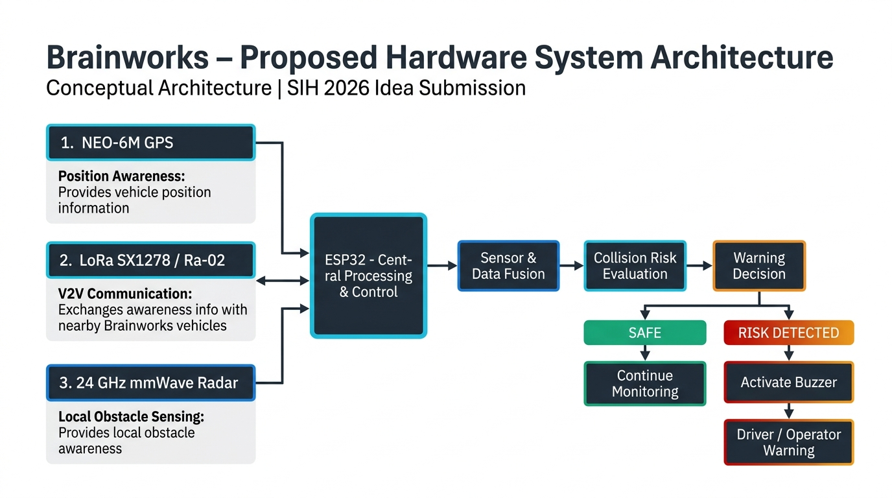
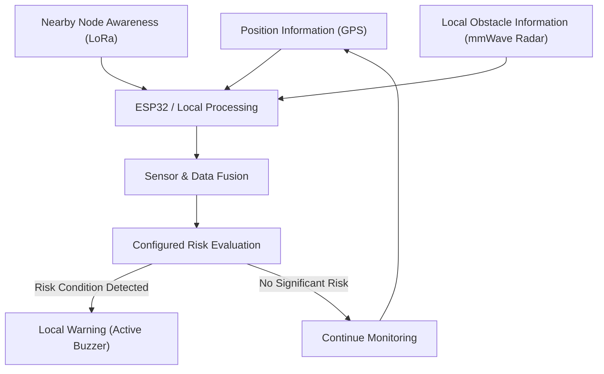
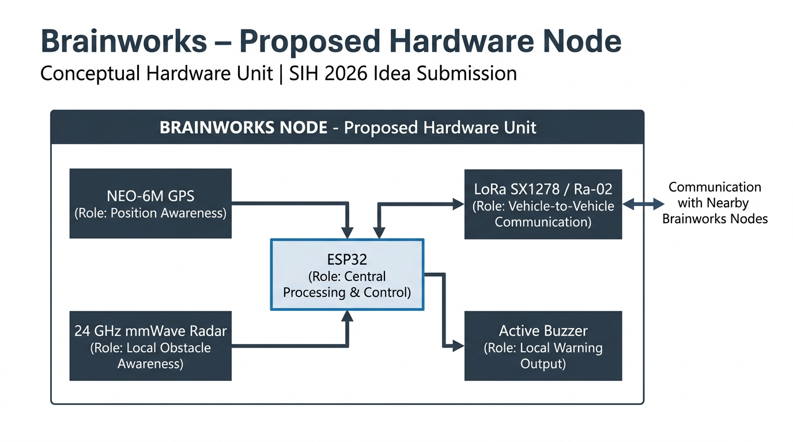
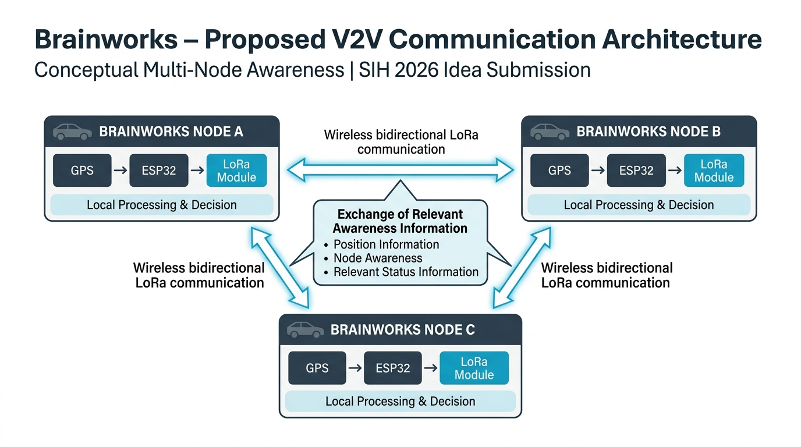
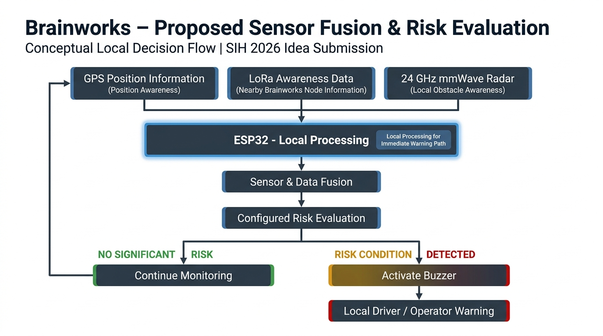

# Brainworks

> A proposed awareness and local warning architecture for improving situational awareness and collision-risk support in challenging mining and industrial operating environments.

**SIH 2026 | Idea / Proposed Solution**

---

## Problem

Mining and industrial operating environments present significant safety challenges that cannot be fully addressed by operator visibility alone:

- **Limited Visibility**: Dust, darkness, weather conditions, and terrain features frequently obstruct operator line-of-sight in active mining environments.
- **Awareness Gaps**: Operators may be unaware of nearby vehicles, equipment, or personnel that are outside their direct field of view.
- **Non-Cooperative Hazards**: Stationary obstacles, unequipped objects, or personnel may not transmit any position information and cannot be detected through communication alone.
- **Reaction Time Constraints**: Heavy equipment operating in confined or high-traffic areas requires timely awareness information to support safe operator decision-making.
- **Infrastructure Limitations**: Remote and underground mining sites often lack reliable cellular or internet connectivity, making cloud-dependent safety systems impractical.

Brainworks is intended to explore how a distributed, infrastructure-independent awareness architecture could provide additional situational awareness support to equipment operators in these conditions.

---

## Proposed Solution

Brainworks proposes a distributed node-based architecture where each equipped vehicle or equipment unit functions as an autonomous awareness node.

The proposed system architecture conceptually combines:

- **Position Awareness**: Each node acquires local geographic position information using an onboard GPS module.
- **Communication-Based Node Awareness**: Participating Brainworks nodes may exchange relevant awareness information through a proposed long-range wireless communication layer.
- **Local Obstacle Sensing**: An onboard radar sensor provides local non-cooperative obstacle detection for hazards that do not transmit position data.
- **Local Processing**: All sensor and communication data is intended to be processed locally on an embedded controller, eliminating cloud dependency for the immediate warning path.
- **Configured Risk Evaluation**: Available data streams are evaluated against configured risk parameters to assess whether a warning condition may exist.
- **Immediate Local Warning**: If a configured risk condition is identified, a local warning mechanism may be activated to alert the operator.

> [!IMPORTANT]
> The Brainworks architecture is currently conceptual and intended for future prototype implementation and validation. No physical hardware prototype has been assembled or tested at this stage.

---

## Key Innovation

- **Distributed Node Architecture**: Each equipped vehicle operates as an autonomous awareness node capable of independent local sensing, communication, and decision-making.
- **Cooperative Awareness**: Participating Brainworks nodes may share relevant position and awareness information with nearby peers through the proposed communication layer.
- **Dual-Layer Perception**: Combines communication-based cooperative awareness with local radar sensing to support detection of both equipped and unequipped hazards.
- **Local Processing Path**: The immediate warning decision path is designed to run locally on the embedded controller, without requiring cloud connectivity or external infrastructure.
- **Modular Architecture**: The node-based architecture is designed to be extensible, supporting future hardware improvements, additional sensing modalities, and evolving software capabilities.

---

## System Overview



> *Conceptual proposed system architecture — not yet implemented in physical hardware.*

**Conceptual Local Processing Flow:**



> [!NOTE]
> The diagram above represents a conceptual processing flow. Not all information sources are assumed to be continuously available in real-world operating conditions.

---

## How Brainworks Works

1. A Brainworks node acquires available local position information from the onboard GPS module.
2. Participating nodes may exchange relevant awareness information through the proposed wireless communication layer.
3. The local radar sensor may provide obstacle awareness information for nearby unequipped objects or hazards.
4. Available sensor and communication inputs are processed locally by the embedded controller.
5. Relevant inputs are combined and evaluated against configured risk parameters.
6. If a configured risk condition is detected, the local warning mechanism may be activated to alert the operator.
7. The monitoring process continues as new information becomes available.

---

## Hardware Architecture

The proposed Brainworks hardware node integrates the following components:

| Component | Proposed Role |
|---|---|
| ESP32 | Central processing and control unit |
| LoRa SX1278 / Ra-02 | Long-range wireless communication between Brainworks nodes |
| NEO-6M GPS | Vehicle position awareness |
| 24 GHz mmWave Radar | Local non-cooperative obstacle sensing |
| Active Buzzer | Immediate local audible warning mechanism |

> [!NOTE]
> The hardware architecture described above is proposed. No physical prototype has been assembled or tested at this stage.

📄 **Full hardware documentation:** [Hardware/README.md](Hardware/README.md)

**Selected Conceptual Architecture Visuals:**







---

## Software Architecture

The `Software/` directory contains the implemented frontend operator dashboard and the proposed backend architecture.

### Frontend Dashboard — Implemented

The frontend operator monitoring dashboard is implemented using Next.js, React, and TypeScript. It provides a vehicle telemetry monitoring interface currently driven by static mock telemetry data.

> [!IMPORTANT]
> The current dashboard is driven by static mock telemetry. Live hardware telemetry integration is a proposed future capability.

### Backend Architecture — Scaffolded

The backend project structure is scaffolded with Node.js, Express, WebSocket, Zod, and Turf.js dependencies configured. Active REST APIs, WebSocket communication, and hardware telemetry interfaces are proposed future development.

### Hardware Integration — Proposed

Real-time communication between the physical hardware nodes and the software architecture represents a future engineering milestone.

📄 **Software documentation:** [Software/README.md](Software/README.md)
📄 **Frontend documentation:** [Software/frontend/README.md](Software/frontend/README.md)
📄 **Backend architecture:** [Software/backend/README.md](Software/backend/README.md)

---

## Current Implementation Status

| Component | Status |
|---|---|
| Frontend Dashboard | ✅ Implemented |
| Dashboard Components | ✅ Implemented |
| Mock Telemetry | ✅ Implemented |
| Simulated Visual Scene | ✅ Implemented |
| Hardware Documentation | ✅ Complete |
| Conceptual Hardware Architecture | ✅ Documented |
| Backend Architecture | 🔧 Scaffolded |
| Physical Hardware Prototype | 🔲 Proposed |
| Live Hardware Telemetry | 🔲 Proposed |
| V2V Communication Integration | 🔲 Proposed |
| Dynamic Risk Evaluation | 🔲 Proposed |
| Real-World Validation | 🔲 Future Work |

---

## Repository Structure

```
Brainworks/
├── Hardware/
│   ├── images/
│   └── README.md
│
├── Software/
│   ├── frontend/
│   ├── backend/
│   └── README.md
│
└── README.md
```

---

## Technology Stack

### Hardware — Proposed Components

| Component | Proposed Purpose |
|---|---|
| ESP32 | Central processing and local decision-making |
| LoRa SX1278 / Ra-02 | Long-range wireless V2V communication |
| NEO-6M GPS | Vehicle position acquisition |
| 24 GHz mmWave Radar | Local obstacle sensing |
| Active Buzzer | Immediate local warning output |

### Software — Implementation and Configuration Status

| Technology | Purpose | Status |
|---|---|---|
| Next.js | Frontend framework | Implemented |
| React | UI rendering | Implemented |
| TypeScript | Type-safe development | Implemented |
| Tailwind CSS | Styling and layout | Implemented |
| Node.js | Backend runtime | Configured / Proposed |
| Express | REST API framework | Configured / Proposed |
| ws (WebSockets) | Real-time communication | Configured / Proposed |
| Zod | Data validation schemas | Configured / Proposed |
| Turf.js | Geospatial processing | Configured / Proposed |

---

## Project Roadmap

### Stage 1 — Idea and Architecture *(Current Stage)*

System concept development, hardware architecture design, software interface implementation, and conceptual documentation.

### Stage 2 — Prototype Development *(Future)*

Physical Brainworks node assembly, initial hardware component integration, and basic bench-level testing.

### Stage 3 — Dynamic Integration *(Future)*

Telemetry data flow implementation, communication integration, dynamic risk evaluation logic, and connection of the hardware layer to the operator dashboard through the backend architecture.

### Stage 4 — Validation *(Future)*

Prototype environment testing, evaluation of system behavior under representative conditions, and iterative engineering refinement.

> [!NOTE]
> Stages 2, 3, and 4 represent future development directions and do not represent committed deployment milestones.

---

## ⚠️ Important Disclaimer

Brainworks is currently an idea-stage / proposed solution with an implemented frontend visualization interface. The proposed hardware architecture, real-time communication, dynamic telemetry integration, and physical prototype require further development and validation before any real-world application. The project does not claim certified safety performance, guaranteed collision prevention, or readiness for industrial deployment. Any future field application would require rigorous engineering validation, environmental testing, and compliance with applicable mining safety standards and regulations.

---

## Documentation

| Document | Description |
|---|---|
| [Hardware Documentation](Hardware/README.md) | Proposed hardware architecture, components, and system design |
| [Software Documentation](Software/README.md) | Software architecture overview and implementation status |
| [Frontend Documentation](Software/frontend/README.md) | Frontend dashboard implementation details |
| [Backend Architecture](Software/backend/README.md) | Proposed backend architecture and configuration |

---

## Smart India Hackathon 2026

Brainworks is being developed as a Smart India Hackathon 2026 proposed solution. The project explores how a distributed, infrastructure-independent node-based architecture could improve situational awareness and support timely local warning generation for operators in challenging mining and industrial environments.

The current submission presents the system concept, proposed hardware architecture, conceptual system visuals, and an implemented frontend operator monitoring dashboard as a demonstration of the proposed interface and visualization layer.

---

*SIH 2026 | Idea Submission | Proposed Solution*
