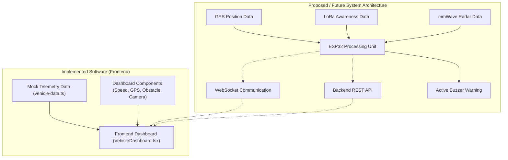

# Brainworks Software

The `Software` directory contains the operator monitoring dashboard implementation and the proposed backend architecture for the Brainworks collision warning and situational awareness system.

---

## Software Architecture

The high-level software architecture establishes a conceptual data path from local hardware perception nodes to an operator monitoring dashboard:

```
Frontend Dashboard
        ↓
Telemetry Data Layer
        ↓
Proposed Backend / Communication Layer
        ↓
Proposed Brainworks Hardware Nodes
```

> [!IMPORTANT]
> The current frontend application is driven by mock telemetry data. Active backend logic, REST APIs, WebSocket streaming, and physical hardware telemetry interfaces are currently proposed architecture and remain to be implemented in future development phases.



---

## Current Software Structure

```
Software/
├── frontend/
│   ├── app/
│   ├── components/dashboard/
│   ├── lib/
│   └── README.md
│
├── backend/
│   └── src/
│       ├── config/
│       ├── controllers/
│       ├── data/
│       ├── routes/
│       ├── schemas/
│       ├── services/
│       ├── utils/
│       ├── websocket/
│       └── server.js
│
└── README.md
```

- **`frontend/`**: Web-based operator monitoring interface built with Next.js, React, and TypeScript.
- **`backend/`**: Node.js backend server template structured into standard application modules for future REST and WebSocket service implementations.

---

## Implemented Functionality

### Vehicle Operator Dashboard

The frontend application provides a single-screen vehicle operator monitoring interface containing:

- **Simulated Camera Feed**: Simulated haul-road view with HUD overlay and status indicators.
- **Vehicle Speed Display**: Speed measurement readout (e.g., `32 km/hr`).
- **Obstacle Status Display**: Visual safety indicator displaying obstacle state (`No obstacle` / `Obstacle detected`).
- **GPS Coordinate Display**: Real-time position coordinate format displaying latitude and longitude readings.
- **Telemetry Information**: Modular telemetry layout displaying node identifiers and metric cards.

> [!NOTE]
> All metrics and visual feeds currently displayed on the dashboard are rendered using static mock telemetry data.

### Dashboard Components

The implemented UI component architecture in `components/dashboard/` includes:

- `VehicleDashboard.tsx`: Main screen container and layout wrapper.
- `CameraFeedView.tsx`: Camera viewport container with overlay corner marks and live indicator.
- `MineCameraScene.tsx`: Scalable SVG graphic illustrating a simulated mine haul-road environment.
- `SpeedSection.tsx` & `SpeedValue.tsx`: Speed metric container and numerical value display component.
- `ObstacleSection.tsx`: Obstacle detection status card with color-coded indicator dot.
- `GpsSection.tsx`: Position coordinate block displaying latitude and longitude values.
- `TelemetryBlock.tsx`: Reusable UI container card for individual telemetry metrics.

---

## Mock Telemetry Layer

### Current Simulation / Mock Data

The frontend telemetry layer is defined in `Software/frontend/lib/vehicle-data.ts`. The primary function `getMockVehicleTelemetry()` supplies static data used for UI visualization:

- **Vehicle Speed**: `32 km/hr`
- **Obstacle Status**: `"clear"`
- **GPS Coordinates**: Latitude `18.5204`, Longitude `73.8567`
- **Camera Identifier**: `CAM-01` (`Forward view`)

> [!IMPORTANT]
> This mock data layer serves as a visual placeholder for UI development and demonstration. It does not represent live hardware telemetry streams or dynamic sensor input.

---

## Proposed Backend Architecture

The backend codebase in `Software/backend/` is scaffolded using Node.js. The directory structure outlines the following planned architectural service layers:

- `config/`: Application environment and system configuration parameters.
- `controllers/`: Request handlers for API endpoint logic.
- `data/`: Data models and persistent storage access layers.
- `routes/`: Express route definitions for REST API endpoints.
- `schemas/`: Request payload and data validation schemas using Zod.
- `services/`: Core business logic, geospatial computations, and telemetry evaluation routines.
- `utils/`: Common helper functions and logging utilities using Pino.
- `websocket/`: Real-time WebSocket connection handling and event broadcasting.

> [!NOTE]
> These subdirectories currently serve as architectural scaffolding. Active backend logic, database persistence, REST endpoints, and WebSocket telemetry streaming are not yet implemented.

---

## Proposed Hardware Integration

The proposed software architecture is designed to integrate with the physical Brainworks hardware nodes through the following conceptual data path:

```
NEO-6M GPS  ──► Position Data ──────────┐
                                        ▼
24 GHz Radar ─► Obstacle Information ─► ESP32 Controller ──► Telemetry Layer ──► Backend / WebSockets ──► Operator Dashboard
                                        ▲
LoRa SX1278 ──► Nearby Node Awareness ──┘
```

- **Immediate Hazard Warning**: The hardware architecture supports local processing on the ESP32 for immediate warning generation via the active buzzer, ensuring zero cloud dependency for the critical safety path.
- **Central Monitoring**: Non-critical telemetry and situational awareness data may eventually be streamed via WebSockets or REST APIs to the backend server for display on the operator dashboard.
- **Architecture Validation**: The final end-to-end integration architecture remains subject to prototype assembly and validation.

---

## Technology Stack

| Category | Technology | Usage / Status |
|---|---|---|
| Frontend Framework | Next.js | Implemented (App Router v16.3) |
| UI Library | React | Implemented (v19) |
| Programming Language | TypeScript | Implemented |
| Styling | Tailwind CSS | Implemented (v4) |
| Backend Runtime | Node.js | Configured / Proposed Backend Stack |
| Web Framework | Express | Configured / Proposed Backend Stack |
| Real-Time Communication | ws (WebSockets) | Configured / Proposed Backend Stack |
| Data Validation | Zod | Configured / Proposed Backend Stack |
| Geospatial Processing | Turf.js (@turf/turf) | Configured / Proposed Backend Stack |
| Logging | Pino | Configured / Proposed Backend Stack |

---

## Implementation Status

| Component / Feature | Implementation Status |
|---|---|
| Frontend Operator Dashboard | Implemented |
| Mock Telemetry Layer | Implemented |
| Simulated Camera Scene | Implemented |
| Backend Server | Scaffolded |
| REST API | Proposed |
| WebSocket Telemetry Streaming | Proposed |
| ESP32 Integration | Proposed |
| GPS Live Data Streaming | Proposed |
| LoRa V2V Data Integration | Proposed |
| mmWave Radar Integration | Proposed |
| Dynamic Risk Evaluation Engine | Proposed |

---

## Future Development Roadmap

- **Phase 1: Dynamic Telemetry Simulation**: Replace static mock telemetry with dynamic data generators to simulate moving vehicles and obstacle detection events.
- **Phase 2: Backend Server Implementation**: Implement active Express web server logic and configuration layers.
- **Phase 3: Telemetry Schemas & Validation**: Define strict Zod validation schemas for incoming hardware and client telemetry packets.
- **Phase 4: Real-Time Communication**: Implement WebSocket server infrastructure for real-time telemetry streaming to the operator dashboard.
- **Phase 5: Prototype Hardware Telemetry Integration**: Interface ESP32 hardware node telemetry outputs with the backend data ingest pipeline.
- **Phase 6: Dynamic Risk Evaluation Logic**: Implement geospatial and multi-sensor risk algorithms using Turf.js on the backend for centralized fleet monitoring.

---

## Project Status

**Current Stage**: SIH 2026 Idea Submission

- **Hardware Architecture**: Conceptual engineering design and visual specification complete.
- **Frontend Dashboard**: User interface layout implemented using Next.js, React, and TypeScript.
- **Telemetry Data**: Powered by static mock/simulated data functions.
- **Backend Architecture**: Directory structure scaffolded; runtime services and APIs proposed.
- **Hardware Integration**: Physical integration remains subject to future prototyping and engineering validation.
