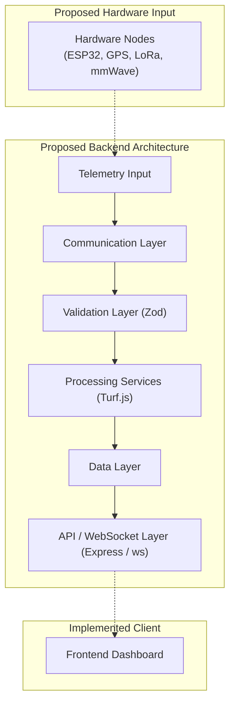

# Brainworks Backend

This directory contains the proposed backend architecture and project configuration for the Brainworks collision warning and situational awareness system.

> [!NOTE]
> The backend codebase is currently scaffolded. It serves as the planned architectural foundation for future telemetry ingestion, data validation, geospatial processing, and real-time communication services.

---

## Current Implementation Status

The backend project structure and package environment have been initialized and scaffolded for future development:

- **Project Structure**: Multi-tier application folder layout prepared in `src/`.
- **Backend Dependencies**: Package dependencies (`express`, `ws`, `zod`, `@turf/turf`, `pino`) configured in `package.json`.
- **Server Entry Point**: `src/server.js` exists as a stub entry file.
- **Active Logic**: REST API routes, WebSocket telemetry streaming, database persistence, and hardware integration are not yet implemented.

### Implementation Status Matrix

| Backend Capability | Current Status |
|---|---|
| Project Structure | Scaffolded |
| Node.js Environment | Configured |
| Backend Dependencies | Configured |
| Server Logic | Not Yet Implemented |
| REST API | Proposed |
| WebSocket Communication | Proposed |
| Telemetry Processing | Proposed |
| Hardware Integration | Proposed |
| Geospatial Processing | Proposed |
| Risk Evaluation Services | Proposed |

---

## Proposed Backend Architecture

The proposed backend architecture establishes a central data pipeline connecting local vehicle hardware nodes to the operator dashboard interface:

```
Brainworks Hardware Nodes
        ↓
Telemetry / Awareness Data
        ↓
Backend Communication Layer
        ↓
Validation & Processing
        ↓
Data / Service Layer
        ↓
API / WebSocket Distribution
        ↓
Operator Dashboard
```

> [!NOTE]
> **Conceptual Future Architecture — Not Yet Implemented**



---

## Directory Structure

```
backend/
├── src/
│   ├── config/
│   ├── controllers/
│   ├── data/
│   ├── routes/
│   ├── schemas/
│   ├── services/
│   ├── utils/
│   ├── websocket/
│   └── server.js
│
├── .env.example
├── .gitignore
├── package.json
└── README.md
```

### Module Responsibilities (Planned Architecture)

- **`config/`**: Intended for future application environment variables, server ports, and database configurations.
- **`controllers/`**: Intended for future HTTP request controllers and API endpoint handlers.
- **`data/`**: Intended for future database models, persistent storage access, or in-memory telemetry buffers.
- **`routes/`**: Intended for future Express API route definitions.
- **`schemas/`**: Intended for future telemetry data validation schemas (using Zod).
- **`services/`**: Intended for future core processing services, geospatial calculation engines, and fleet analysis logic.
- **`utils/`**: Intended for shared utility functions and application logging helpers (using Pino).
- **`websocket/`**: Intended for future WebSocket server handlers, channel subscriptions, and telemetry broadcasting routines.
- **`server.js`**: Intended backend server entry point for bootstrapping Express and WebSocket listeners.

---

## Configured Technology Stack

| Technology | Planned / Configured Purpose |
|---|---|
| Node.js | Backend runtime environment |
| Express | Planned REST API and HTTP server framework |
| ws | Planned WebSocket real-time communication library |
| Zod | Planned request payload and telemetry validation schema engine |
| Turf.js (@turf/turf) | Potential geospatial spatial calculations and boundary analysis |
| Pino | Planned structured JSON logger |

> [!NOTE]
> These dependencies are configured in `package.json`, but their runtime usage depends on future implementation.

---

## Proposed Telemetry Processing

In future development phases, the backend is planned to process the following conceptual data streams:

- **Position Information**: Vehicle geographic coordinates, heading, and speed telemetry.
- **Nearby Node Awareness**: V2V telemetry received from participating Brainworks nodes via LoRa.
- **Local Obstacle Information**: Radar obstacle state and proximity information.
- **Node Status & Health**: Hardware state indicators and diagnostic metrics.
- **Warning Events**: Alert triggers and high-priority hazard event logs.

> [!NOTE]
> The exact telemetry packet schema, field formats, and storage structures have not yet been finalized.

---

## Proposed Real-Time Communication

The `src/websocket/` directory is prepared for future real-time communication infrastructure. Planned responsibilities include:

- Streaming live vehicle telemetry updates from backend ingest services to connected operator dashboards.
- Broadcasting high-priority safety alert notifications across connected fleet monitoring clients.
- Distributing system state and node connectivity events.

> [!IMPORTANT]
> WebSocket communication is currently un-implemented.

---

## Proposed Geospatial Processing

Turf.js (`@turf/turf`) is configured as a potential library for future geospatial processing tasks:

- **Position Comparison**: Evaluating relative geographic positions between multiple vehicle nodes.
- **Distance Calculations**: Computing spatial separation distances between vehicles and site assets.
- **Geofencing & Boundary Analysis**: Analyzing vehicle positions relative to defined hazard zones or mining pit boundaries.

> [!NOTE]
> No active geospatial processing logic is currently operational.

---

## Relationship with Brainworks Hardware

```
Proposed Brainworks Node
  ├── GPS Position Data
  ├── LoRa Awareness Info
  └── mmWave Radar Info
        │
        ▼
Local ESP32 Processing
        │
        ├─────────────────────────────────────────┐
        ▼                                         ▼
Immediate Hazard Warning               Optional Telemetry Upload
(Active Buzzer Output)                  (Future Backend / WebSockets)
        │                                         │
        ▼                                         ▼
Zero-Cloud Immediate Path                 Operator Dashboard
```

- **Immediate Warning Independence**: Immediate hazard warning decisions are processed locally on the ESP32 main controller to eliminate network latency.
- **Optional Backend Role**: The backend architecture is designed for central fleet monitoring, historical logging, and dashboard visualization. It is not mandatory for local collision warning functionality.

---

## Future Development Path

- **Phase 1 — Server Foundation**: Implement active Node.js / Express web server initialization in `src/server.js`.
- **Phase 2 — Data Models and Validation**: Implement Zod schemas for incoming telemetry validation.
- **Phase 3 — API Layer**: Implement REST API controllers and endpoint routes in `src/controllers/` and `src/routes/`.
- **Phase 4 — Real-Time Communication**: Implement active WebSocket connection management and broadcast channels in `src/websocket/`.
- **Phase 5 — Simulation Integration**: Connect dynamic multi-vehicle telemetry simulators to backend ingestion endpoints.
- **Phase 6 — Hardware Integration**: Interface physical ESP32 prototype node outputs with backend telemetry ingestion pipelines.
- **Phase 7 — Validation and Testing**: Conduct end-to-end telemetry streaming, stress testing, and geospatial accuracy validation.

---

## SIH 2026 Project Context

- **Project Stage**: Smart India Hackathon 2026 Idea Submission / Proposed Solution.
- **Backend Status**: Project configuration and architectural folder layout prepared; runtime API services and WebSocket servers are proposed future work.
- **Client Integration**: The implemented frontend dashboard currently operates on static mock data pending backend development.
- **Hardware Integration**: Live physical node communication remains a future engineering milestone.
