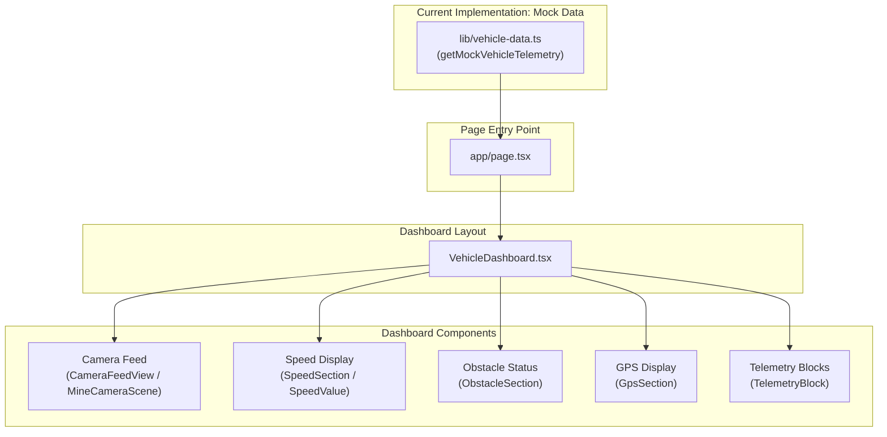

# Brainworks Frontend

This directory contains the web-based vehicle operator monitoring dashboard frontend for the Brainworks collision warning and situational awareness system.

---

## Current Implementation

The frontend currently provides an implemented vehicle operator dashboard user interface. 

The implemented UI includes:

- **Vehicle Monitoring Dashboard**: Integrated operator monitoring view displaying critical vehicle telemetry metrics.
- **Simulated Camera Feed Interface**: Haul-road camera viewport with HUD overlays and live status indicator.
- **Vehicle Speed Display**: Speed measurement display (`32 km/hr`).
- **Obstacle Status Display**: Visual safety indicator displaying obstacle state (`No obstacle` / `Obstacle detected`).
- **GPS Coordinate Display**: Geographic position format displaying latitude and longitude readings.
- **Telemetry Information Display**: Modular telemetry card layout.

> [!IMPORTANT]
> The current dashboard is driven by static mock telemetry and does not yet receive live hardware data.

---

## Technology Stack

| Technology | Purpose |
|---|---|
| Next.js | Frontend framework (v16.3 App Router) |
| React | UI rendering (v19) |
| TypeScript | Type-safe application development |
| Tailwind CSS | Styling and UI layout (v4) |

---

## Project Structure

```
frontend/
├── app/
│   ├── layout.tsx
│   ├── page.tsx
│   └── globals.css
│
├── components/
│   └── dashboard/
│       ├── VehicleDashboard.tsx
│       ├── CameraFeedView.tsx
│       ├── MineCameraScene.tsx
│       ├── SpeedSection.tsx
│       ├── SpeedValue.tsx
│       ├── ObstacleSection.tsx
│       ├── GpsSection.tsx
│       └── TelemetryBlock.tsx
│
├── lib/
│   └── vehicle-data.ts
│
└── README.md
```

- **`app/`**: Next.js App Router root layout, page entry point, and global CSS styles.
- **`components/dashboard/`**: React components representing operator dashboard UI elements.
- **`lib/`**: Telemetry data models and mock telemetry generator functions.

---

## Dashboard Components

| Component | Current Responsibility |
|---|---|
| `VehicleDashboard.tsx` | Main dashboard layout and composition |
| `CameraFeedView.tsx` | Camera feed presentation container |
| `MineCameraScene.tsx` | Simulated visual mine/haul-road scene |
| `SpeedSection.tsx` | Vehicle speed section |
| `SpeedValue.tsx` | Speed value presentation |
| `ObstacleSection.tsx` | Obstacle status presentation |
| `GpsSection.tsx` | GPS coordinate presentation |
| `TelemetryBlock.tsx` | Reusable telemetry display block |

---

## Mock Telemetry

### Current Mock / Simulation Layer

The telemetry data layer is defined in `lib/vehicle-data.ts`. The exported function `getMockVehicleTelemetry()` supplies static data used for UI visualization:

- **Vehicle Speed**: `32 km/hr`
- **Obstacle Status**: `"clear"`
- **GPS Coordinates**: Latitude `18.5204`, Longitude `73.8567`
- **Camera Identifier**: `CAM-01` (`Forward view`)

> [!NOTE]
> This mock data function acts as a visual placeholder for UI development and demonstration. It does not represent live hardware telemetry streams or dynamic sensor input.

---

## Application Flow



---

## Running the Frontend

### 1. Install Dependencies

```bash
npm install
```

### 2. Run Development Server

```bash
npm run dev
```

Open [http://localhost:3000](http://localhost:3000) with your browser to view the operator dashboard.

### 3. Build for Production

```bash
npm run build
```

### 4. Start Production Server

```bash
npm run start
```

### 5. Code Quality / Linting

```bash
npm run lint
```

---

## Current Limitations

The frontend application currently exhibits the following development stage limitations:

- **Static Mock Telemetry**: Telemetry values are static mock data generated in code.
- **No Live ESP32 Connection**: Serial or hardware bridge connection to the physical controller is not yet implemented.
- **No Active Backend Connection**: REST or WebSocket connections to `Software/backend` are un-implemented.
- **No Real-Time LoRa Telemetry**: V2V peer node information is not yet streamed to the UI.
- **No Live GPS Integration**: GPS coordinates are static mock values.
- **No Live mmWave Radar Data**: Radar obstacle status is static mock data.
- **Simulated Camera Scene**: The camera viewport renders a static SVG graphic scene rather than a physical camera stream.

---

## Proposed Future Integration

In future development phases, the frontend dashboard will integrate with the physical hardware architecture through the following proposed telemetry pipeline:

```
Brainworks Hardware Node
        ↓
GPS / Radar / Nearby Node Information
        ↓
Telemetry Communication Layer
        ↓
Backend / WebSocket Infrastructure
        ↓
Frontend Dashboard
```

> [!NOTE]
> This end-to-end integration is a proposed system capability for future engineering phases.

---

## Implementation Status

| Feature | Status |
|---|---|
| Dashboard UI | Implemented |
| Dashboard Components | Implemented |
| Mock Telemetry | Implemented |
| Simulated Camera Scene | Implemented |
| Live Hardware Telemetry | Proposed |
| Backend Integration | Proposed |
| WebSocket Streaming | Proposed |
| Live GPS Data | Proposed |
| Live Radar Data | Proposed |
| LoRa Data Visualization | Proposed |

---

## SIH 2026 Project Context

- **Project Stage**: Smart India Hackathon 2026 Idea Submission / Proposed Solution.
- **Frontend Role**: The frontend dashboard is fully implemented as an operator visualization interface for presentation and software validation.
- **Hardware & Telemetry Integration**: Live ESP32 hardware connection, backend streaming, and physical multi-node telemetry remain future engineering milestones.
